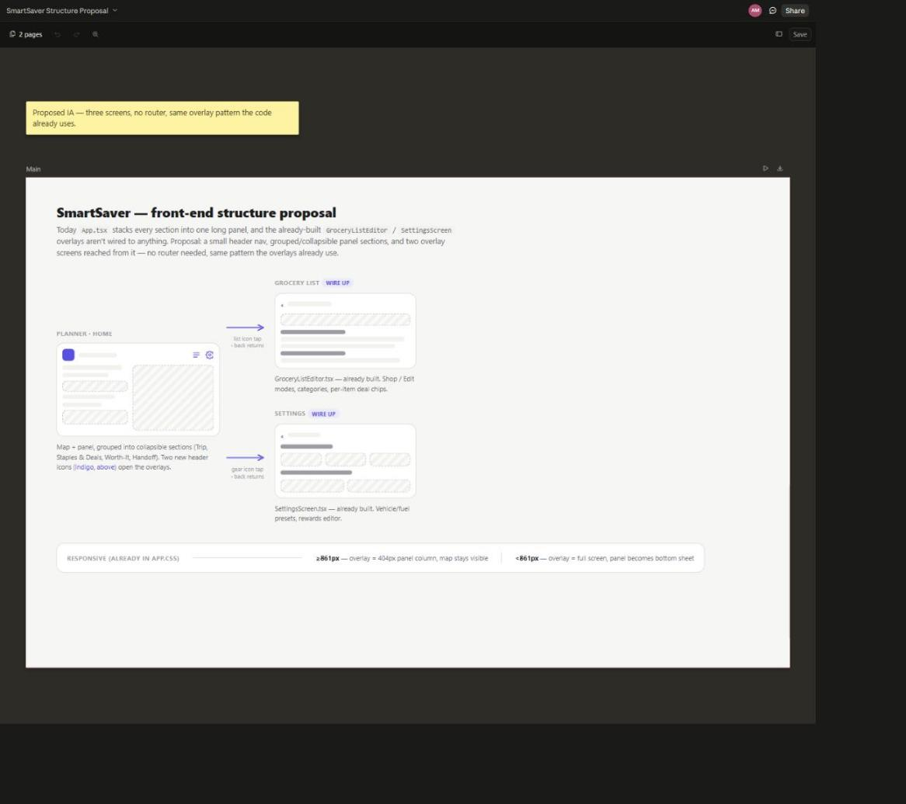
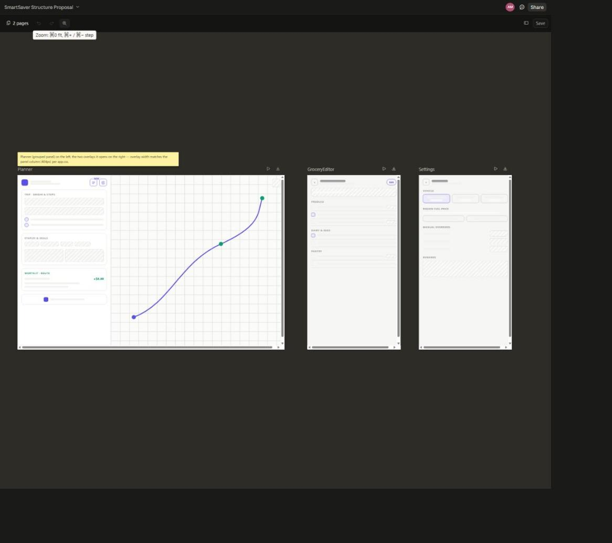

# SmartSaver — front-end structure proposal (v1)

Today `App.tsx` stacks every panel section into one long scroll, and two
screens that are already built — `GroceryListEditor.tsx` and
`SettingsScreen.tsx` — aren't wired to anything (no button opens them). This
is a v1 proposal for the structure: a small header nav, panel sections
grouped instead of flat-stacked, and those two screens reached as overlays —
no router needed, the same `ge-overlay` pattern the code already uses (fixed,
404px panel column on desktop ≥861px; full screen on mobile, per `app.css`).

**Live, pannable canvas:** [SmartSaver Structure Proposal](https://claude.ai/code/artifact/98fdc5eb-9731-4a06-baaf-246fbf707ac1)

## Structure

Planner stays home. A list icon and a gear icon in the header open the
Grocery List and Settings overlays; the overlay's own `‹` back returns to
the Planner. Nothing here is new UI — both overlays exist in the codebase
today, just unreachable.

## Screens

- **Planner** — map + panel, panel sections grouped (Trip · origin & stops,
  Staples & deals, Worth-it · route, Handoff) instead of one flat stack.
- **Grocery List** (`GroceryListEditor.tsx`) — Shop/Edit modes, categories,
  per-item deal chips.
- **Settings** (`SettingsScreen.tsx`) — vehicle/fuel presets, rewards editor.

## Status

Static wireframe, not a clickable prototype. Open questions for v2: where
the two header icons actually sit in the brand row, and whether panel
sections collapse by default or start expanded.
